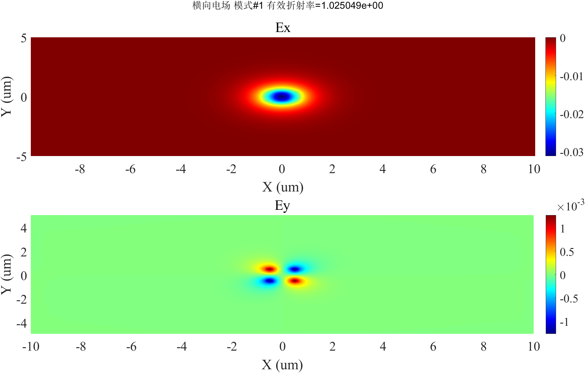
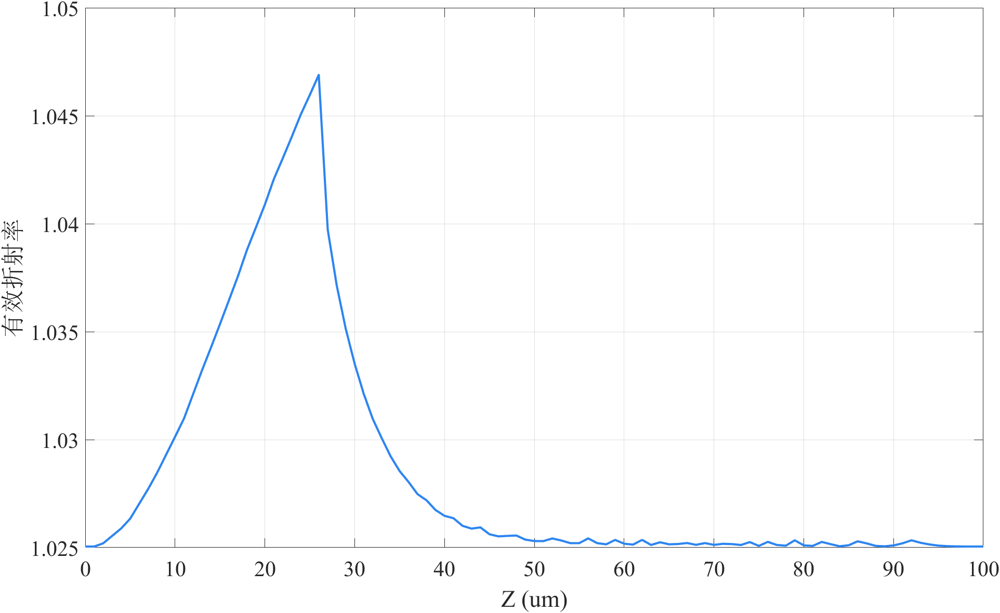
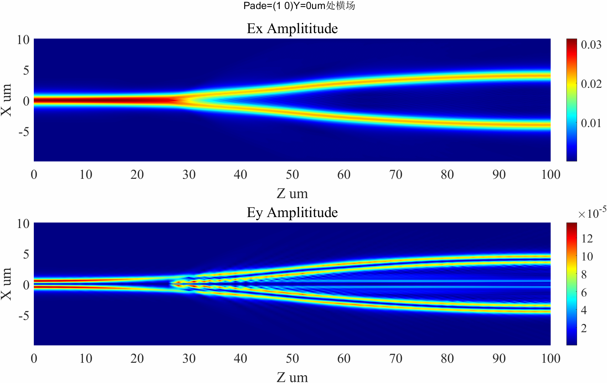
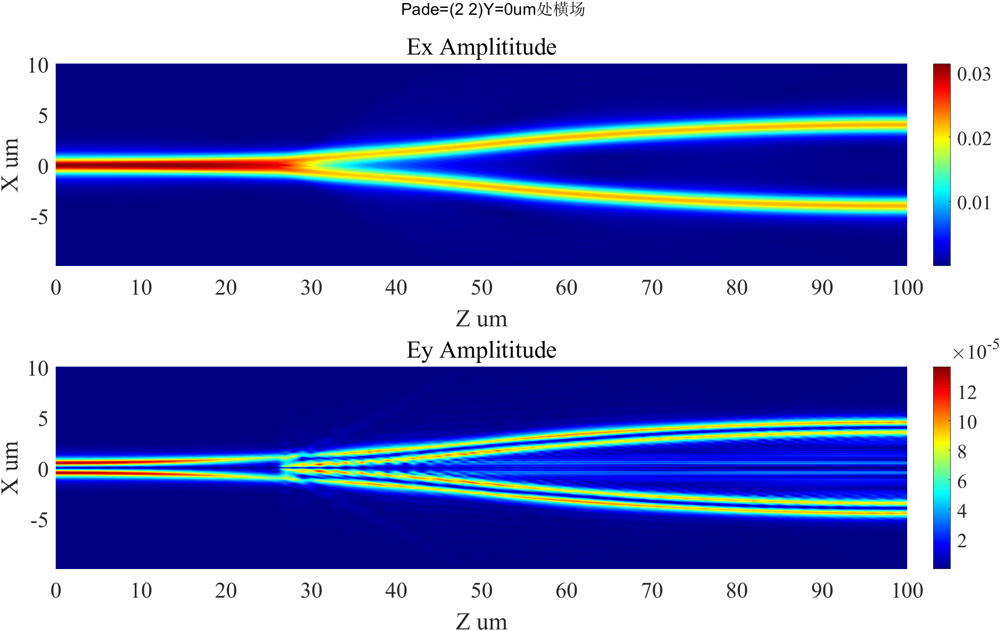
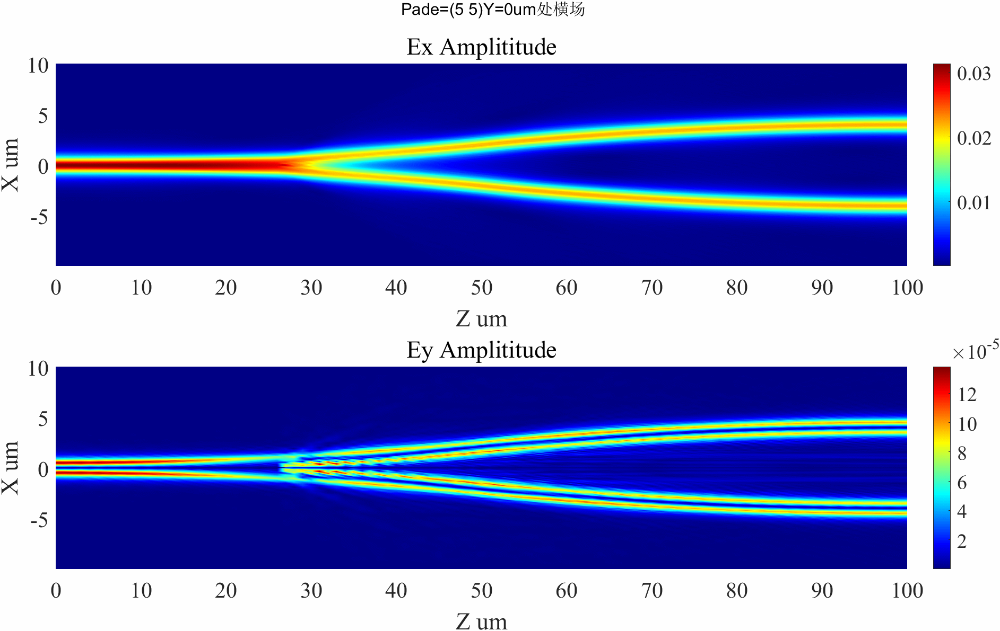

# Y波导示例

## 代码
```
lx = 20;
ly = 10;
lz = 100;
dx = 0.1;
dy = 0.1;
dz = 1;
lambda = 1;
input_mode_select = 1;
pade_order = 6;
alpha = 0.5;
plot_incident_field = 0;
plot_structure = 0;
dynamic_neff = 1;
load_neff = 1;
```

## 结构


<!--  -->


## 入射电场


## 参考折射率



<!-- ## PEC边界结果

 
 
 -->

## PML边界结果

### Pade(1,0)




### Pade(2,2)



### Pade(5,5)

